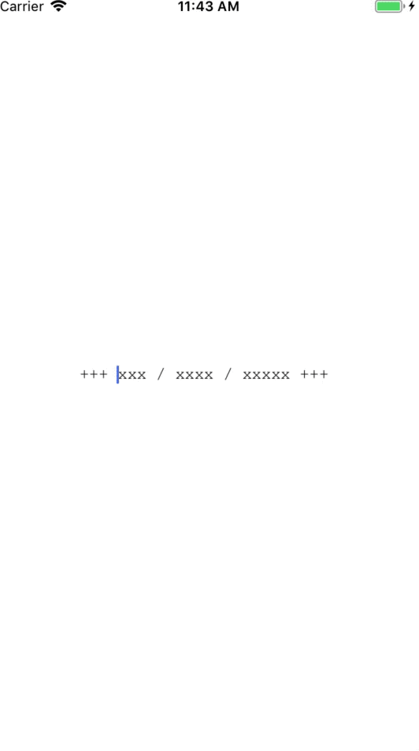

TextMasker is an library written in Swift to make masking text easy.

## Demo



## Features

Specify a mask for example:

```swift
let nationalSecurityNumberMask = "xx.xx.xx-xxx.xx"
let accountNumberMask = "6703 xxxx xxxx xxxx x"
let communicationMask = "+++ xxx / xxxx / xxxxx +++"
```

Specify the valid characters that can be put in:

```swift
let validCharacters = CharacterSet.decimalDigits
```

Specify the valid replacement characters in the mask in this example only the x's:

```swift
let replaceCharacters = CharacterSet(charactersIn: "x")
```

Simply create a instance:

```swift
self.masker = TextMasker(mask: communicationMask, validCharacters: validCharacters, replacementCharacters: replaceCharacters)
```

Set the initial state:

```swift    
self.textField.text = self.masker.mask
self.textField.delegate = self    
self.textField.font = UIFont(name: "couriernewpsmt", size: 14)
```
        
Implement UITextFieldDelegate:

```swift
extension ViewController: UITextFieldDelegate {
    func textFieldDidBeginEditing(_ textField: UITextField) {
        let currentPositionInMask = self.masker.cursorPosition
        textField.setCursor(to: currentPositionInMask)
    }
    
    func textField(_ textField: UITextField, shouldChangeCharactersIn range: NSRange, replacementString string: String) -> Bool {
        let result = string == "" ? self.masker.remove() : self.masker.add(string: string)
        textField.text = result
        
        let currentPositionInMask = self.masker.cursorPosition
        textField.setCursor(to: currentPositionInMask)
        
        return false
    }
}
```
    
Profit!

### Notes

Use a monospaced font otherwise you will see the mask grow/shrink.

There is an example app in the repo.

## Requirements

- iOS 10.3 or higher
- Swift 4.2

## Installation

### Carthage

[Carthage](https://github.com/Carthage/Carthage) is a decentralized dependency manager that builds your dependencies and provides you with binary frameworks.

You can install Carthage with [Homebrew](https://brew.sh/) using the following command:

```bash
$ brew update
$ brew install carthage
```

To integrate TextMasker into your Xcode project using Carthage, specify it in your `Cartfile`:

```ogdl
github "donpironet/TextMasker" ~> 1.0.0
```

Run `carthage update` to build the framework and drag the built `Alamofire.framework` into your Xcode project.


## License

TextMasker is released under the MIT license.